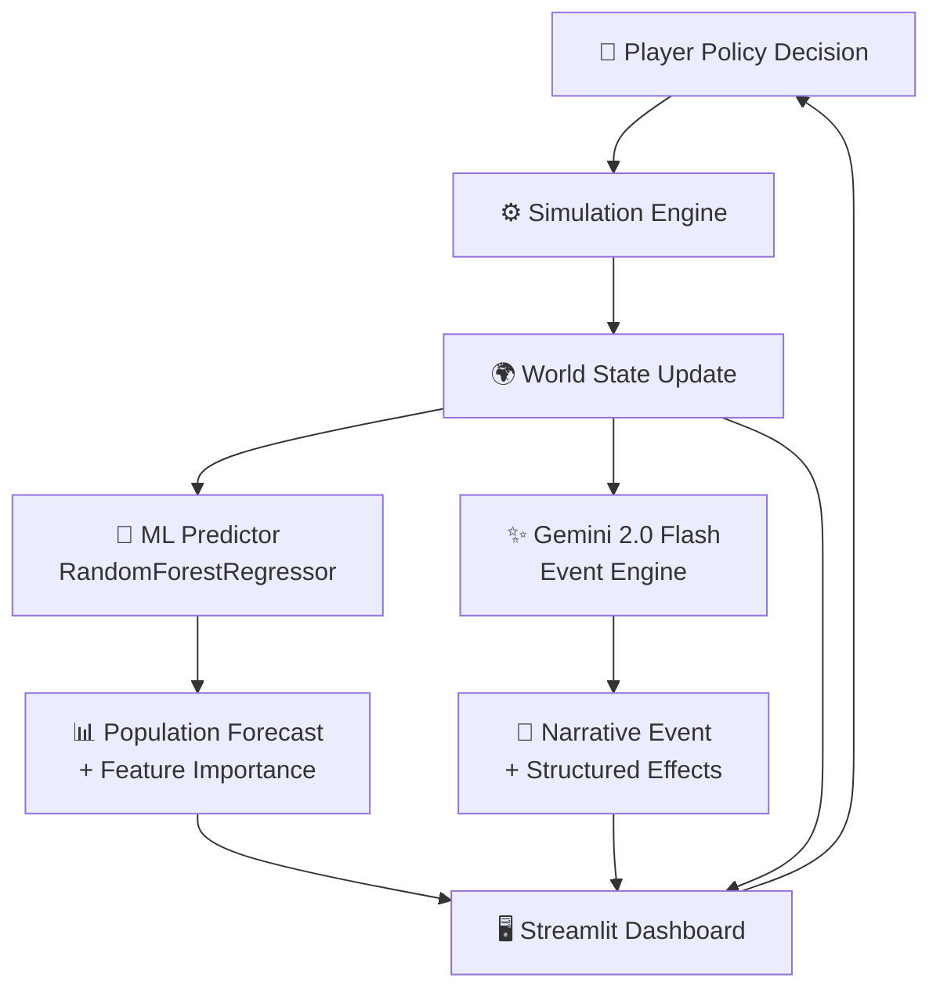

# CIV-AI 🌍 — Machine Learning Civilization Simulator

> **A research-grade AI engineering sandbox** combining supervised ML prediction, generative AI event systems, explainable AI, and an interactive simulation dashboard.

[](https://python.org)
[](https://scikit-learn.org)
[](https://streamlit.io)
[](https://ai.google.dev)
[](LICENSE)

---

## Overview

CIV-AI simulates the evolution of a civilization year-by-year. Each annual cycle:

1. The **player selects a governing policy** (Agriculture / Industry / Education / Environment)
2. The **deterministic simulation engine** applies socio-economic physics to update the world state
3. A **trained Random Forest regressor** predicts the population consequence and explains which features drive the prediction
4. **Gemini 2.0 Flash** generates a contextual world event (drought, breakthrough, pandemic) conditioned on the current civilization state
5. The **Streamlit dashboard** renders historical trends, explainability visualizations, and real-time metrics

The goal: keep your civilization alive and thriving for 100 years.

---

## System Architecture



---

## World State Model

| Variable | Range | Description |
|---|---|---|
| `population` | 0 → ∞ | Total citizens |
| `food` | 0 → ∞ | Agricultural reserves |
| `energy` | 0 → ∞ | Industrial capacity |
| `technology` | 0 → 500 | Research & innovation level |
| `pollution` | 0 → 100 | Environmental degradation index |
| `economy` | 0 → ∞ | Economic output |
| `happiness` | 0 → 100 | Social well-being |
| `legitimacy` | 0 → 100 | Public trust in government ⭐ |

> `legitimacy` is an original addition: it decays when happiness is low over multiple years. When it hits 0, a forced revolution event fires — creating dual survival pressure beyond just resource management.

---

## Machine Learning Pipeline

### Data Generation
- **5,000 synthetic episodes** each starting from a randomized WorldState covering the full variable range
- Each episode applies one random policy and records the resulting state transition
- Target variable: `delta_population`

### Model
| Parameter | Value | Rationale |
|---|---|---|
| Algorithm | `RandomForestRegressor` | Interpretable, robust, no GPU required |
| `n_estimators` | 150 | Stable variance |
| `max_depth` | 10 | Prevents overfitting on synthetic data |
| `min_samples_leaf` | 5 | Smooth leaf predictions |
| `random_state` | 42 | Reproducibility |

### Results
| Metric | Value |
|---|---|
| R² Score | *run `train.py` to see* |
| RMSE | *run `train.py` to see* |

### Explainability
Feature importances from the trained forest are extracted per-prediction and visualized as a bar chart. An **OOD confidence detector** flags when the current state deviates significantly from the training distribution — teaching users about ML generalization limits in context.

---

## Generative AI Event Engine

Events are generated by **Gemini 2.0 Flash** (free tier) using a structured prompt conditioned on the current world state:

```
Civilization state: Year 14, Population 1.2M, Food LOW, Pollution 73/100
→ "A toxic smog event forces mass evacuations from industrial zones,
   cutting economic output and triggering civil unrest."
→ effects: { economy: -12.0, happiness: -15.0, population: -8000 }
```

Automatic **local fallback** activates if the API is rate-limited, ensuring the simulation never stalls.

---

## Tech Stack

| Layer | Technology | Version |
|---|---|---|
| Language | Python | 3.10+ |
| Simulation Core | Custom physics engine | — |
| ML Framework | scikit-learn | 1.4+ |
| Generative AI | Google Gemini 2.0 Flash | via `google-generativeai` |
| Data Processing | pandas, numpy | latest stable |
| Model Serialization | joblib | latest stable |
| UI Framework | Streamlit | 1.32+ |
| Testing | pytest | 8.0+ |
| Env Management | python-dotenv | 1.0+ |

---

## Project Structure

```
civ-ai/
├── src/
│   ├── world_state.py        # WorldState dataclass
│   ├── simulation_engine.py  # Deterministic physics engine
│   ├── data_pipeline.py      # Synthetic dataset generator
│   ├── ml_model.py           # RandomForest + explainability + OOD detection
│   ├── event_engine.py       # Gemini 2.0 Flash + local fallback
│   └── explainability.py     # Feature importance + confidence rendering
├── ui/
│   └── app.py                # Streamlit dashboard
├── tests/
│   └── test_simulation.py    # pytest unit tests
├── docs/
│   ├── PROJECT_REPORT.md     # IEEE-style technical report
│   ├── ARCHITECTURE.md       # System architecture deep-dive
│   └── ML_PIPELINE.md        # ML design decisions & evaluation
├── .env.example              # Key template (never commit .env)
├── requirements.txt
└── README.md
```

---

## Quick Start

```bash
# 1. Clone and install
git clone https://github.com/kunal-gh/civ-ai.git
cd civ-ai
pip install -r requirements.txt

# 2. Configure environment
cp .env.example .env
# Edit .env and add your Gemini API key

# 3. Generate data and train the ML model
python training/train.py

# 4. Launch the simulator
python -m streamlit run ui/app.py
```

---

## Novel Features

| Feature | Description |
|---|---|
| **Legitimacy Meter** | Tracks public trust; collapses trigger forced revolution events |
| **Technology Multipliers** | Tech > 50 boosts food/economy; Tech > 100 enables clean-tech pollution reduction |
| **OOD Confidence Flag** | ML warns when predicting on states far from training data |
| **Year-End Report Card** | AI narrative summary every 10 years of civilization trajectory |
| **Scenario Seeds** | Pre-built starting states: Post-War Ruins, Industrial Boom, Overcrowded Megacity |

---

## Documentation

- [📄 IEEE Project Report](docs/PROJECT_REPORT.md)
- [🏗️ System Architecture](docs/ARCHITECTURE.md)
- [🧠 ML Pipeline Deep-Dive](docs/ML_PIPELINE.md)

---

## License

MIT — see [LICENSE](LICENSE)
