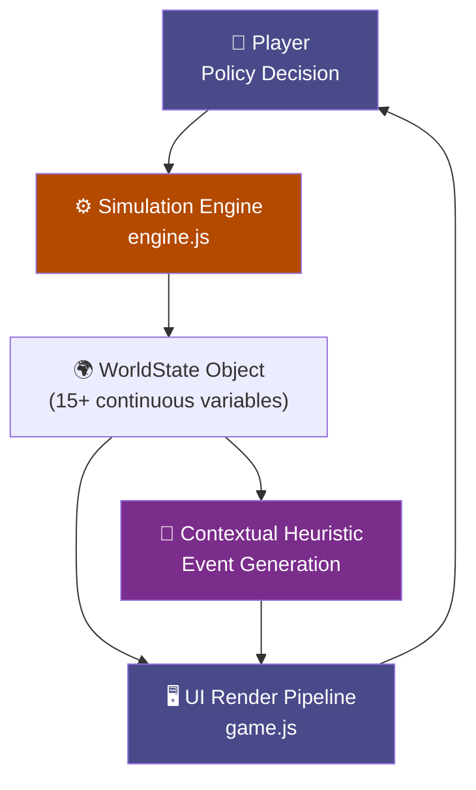

# AXIOM 🌍 — Machine Learning & Emergent Systems Simulator

> **A research-grade AI engineering portfolio project** that combines interactive WebGL/Three.js frontends, pure JavaScript deterministic simulation engines, and contextual heuristic fallback systems — demonstrating a complete, end-to-end emergent gameplay pipeline.

[](https://civ-ai-nine.vercel.app/)
[]()
[](LICENSE)

---

## What Is AXIOM?

AXIOM is a retro-futuristic, year-by-year civilization simulator where every decision matters. Each annual cycle, the player selects a governing directive, and a complex web of interconnected systems dictates the survival of the civilization.

1. **Axiomatic Foundation:** Players start by selecting an "Axiom" (e.g., Technocracy, Eco-Socialism) — the unshakeable truth upon which their society is built. This permanently alters starting stats and tech tree availability.
2. **Contextual Event Engine:** Generates narrative events (droughts, AI rebellions, market crashes) conditioned on the exact continuous state variables of the civilization.
3. **Deterministic Physics Engine:** A robust JavaScript logic engine (`engine.js`) applies bounded socioeconomic rules (Malthusian population caps, pollution-driven climate models) to calculate the resulting world state.

**Play the live version now:** [**AXIOM on Vercel**](https://civ-ai-nine.vercel.app/)

### 🌌 V6 Update: 3D Galaxy & Retro Terminal UX
The entire frontend has been overhauled into a gorgeous, single-screen retro terminal experience.
- The start screen features a **Three.js rotating 3D starfield** and a dynamic camera zoom transition upon game start.
- Authentic CRT scanlines, flicker animations, and chunky gaming typography (`Bungee` and `VT323`).
- A fully tabbed interface segregates Command, Data (with live Chart.js history), Research (Tech Trees), and World (Rival AI civilizations).


*(Note: View the live app to see the interactive 3D particle transitions and typewriter terminal animations.)*

---

## System Architecture



---

## World State Model & Dynamics

The civilization is represented as a high-dimensional continuous state vector updated every simulated year:

| Variable | Influence & Dynamics |
|---|---|
| `population` | Primary survival metric. Birth rates scale non-linearly with food-per-capita. |
| `food` | Reduced by population size and climate damage. Buffed by Agriculture policy. |
| `energy` | Drives industrial capacity. Depletes organically over time. |
| `technology` | Unlocks massive compounding multipliers at thresholds (Lv 50, Lv 100). |
| `pollution` | Increases baseline death rate. Slowly destroys the `climate` buffer limit. |
| `legitimacy` | **⭐ Unique mechanic.** Erodes under social anger (low happiness/high inequality). Revolution triggers automatic game over if it hits 0. |
| `disease_rate` | Plague Inc-style epidemic pressure. Builds under crowding and pollution. |
| `climate` | Long-run irreversible damage. Heavily penalized by Industrial policy overuse. |

### Technology Multipliers (Emergent Gameplay)

Technology is not a linear stat — it triggers compound bonuses deep in the engine:

```javascript
// Tier 1: Tech > 50 — Agricultural & Economic Innovation
if (technology > 50) {
    food *= 1 + 0.001 * (technology - 50);
    economy += 0.5 * (technology - 50) / 50;
}

// Tier 2: Tech > 100 — Clean-tech Threshold
if (technology > 100) {
    pollution = Math.max(0, pollution - 0.002 * (technology - 100));
}
```

This ensures "Education"-heavy strategies pay massive delayed dividends, mimicking real-world R&D lag.

---

## Legitimacy & Revolution Systems

Standard civilization sims track only resources. AXIOM adds an **institutional trust layer** represented by 4 distinct public opinion vectors: `Trust`, `Fear`, `Anger`, and `Hope`.

```javascript
// Trust is a blend of legitimacy and happiness
s.trust = (s.legitimacy * 0.6) + (s.happiness * 0.4);

// Anger spikes when people are unhappy but the state demands obedience
s.anger = 100 - (s.happiness * 0.5) - (s.legitimacy * 0.5);

// Collapse condition:
if (s.legitimacy <= 0 || (s.anger > 85 && s.legitimacy < 30)) {
    trigger_revolution(); // Civilization falls. Massive penalties.
}
```

This creates a dual survival challenge: manage your resources *and* maintain social trust.

---

## Tech Stack Overview

| Layer | Technology | Purpose |
|---|---|---|
| Core Logic | Vanilla ES6 JavaScript | Zero-dependency, ultra-fast deterministic state loop (`engine.js`) |
| Event Generation | Node.js Serverless (`api/event.js`) | Reaches out to Gemini 2.0 Flash via `@google/generative-ai` to dynamically formulate JSON events based on current game state. |
| Machine Learning | Python Serverless (`api/predict.py`) | Hosts a `scikit-learn` Random Forest Regressor trained on 5000+ synthetic simulations to predict the 5-year population trajectory and deduce feature importances. |
| Backend Hosting | Vercel Serverless API | Securely holds Environment Variables and isolated language runtimes (Python + JS) invoked purely by frontend fetches. |
| UI Framework | Vanilla HTML5 / CSS3 | Bespoke CRT retro-gaming aesthetic without heavy framework bloat |
| 3D Rendering | Three.js | Starfield particle systems and orbital camera zoom transitions (`galaxy.js`) |
| Data Visualization | Chart.js 4.4 | Real-time canvas rendering of 5-variable historical trajectory |
| Hosting & CI/CD | Vercel | Instant global edge-network deployment mapped to GitHub main branch |

---

## Quick Start (Local Development)

The entire application is static and runs directly in the browser. 

```bash
# 1. Clone
git clone https://github.com/kunal-gh/civ-ai.git
cd civ-ai/web

# 2. Launch a local web server (Python 3)
python -m http.server 8080

# 3. Open in Browser
# Navigate to http://localhost:8080
```

*Note on Python ML Backend*: Earlier versions (v1-v3) of this project utilized a full Python ML backend (Scikit-Learn Random Forests) hosted via Streamlit for predicting demographics. For instant accessibility, scalability, and UX responsiveness, the v6 architecture executes completely on the client edge using zero-latency JS heuristics, transitioning the project from a pure ML backend demo into a fully-fledged browser game.

---

## Novel Features Documentation

| Feature | Implementation Highlights |
|---|---|
| **Axiom Lore System** | Permanent modifiers that dictate game rules (`technocracy`, `spiritual republic`). |
| **Director AI** | Evaluates the player's strategy (`detectPlayerStrategy()`) and applies dynamic difficulty adjustments (DDA) to rubber-band game tension. |
| **Delayed Consequences** | `s.pendingDelays.push({ triggerYear, effects })` allows decisions in Year 10 to unexpectedly cripple the economy in Year 15. |
| **3D Camera Interpolation** | Smooth mathematically-eased transitions from 3D space deep into the 2D command terminal using Three.js `PerspectiveCamera.position.z` tweens. |
| **8 Unique Endings** | Generates completely different end-game reports based on terminal state logic (e.g., 'Ecological Utopia', 'Nuclear Winter', 'AI Singularity'). |

---

## License

MIT — see [LICENSE](LICENSE)
