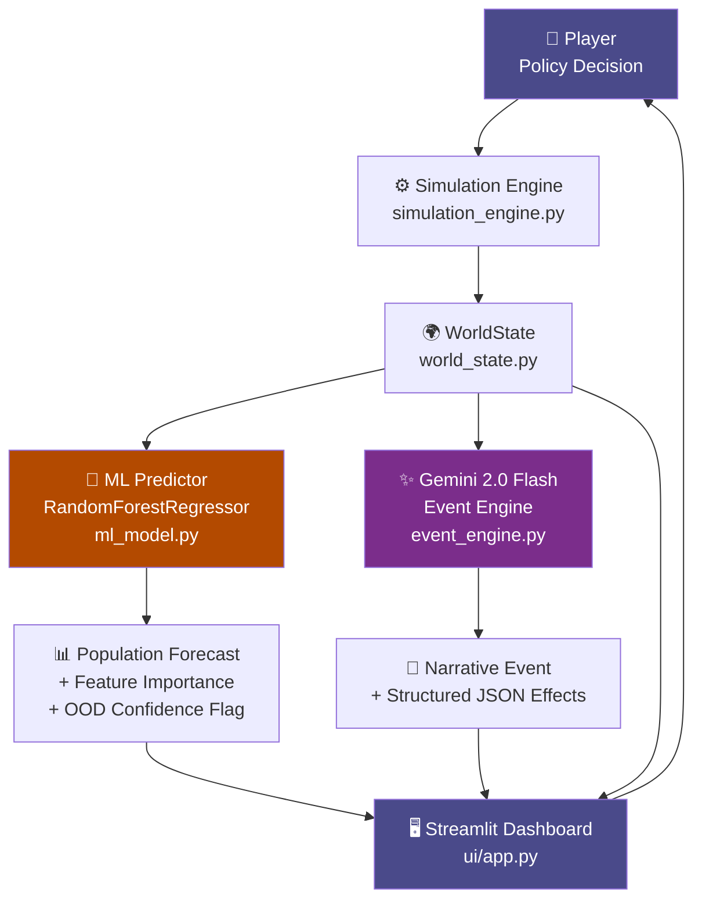

# CIV-AI 🌍 — Machine Learning–Driven Civilization Simulator

> **A research-grade AI engineering system** that combines supervised machine learning, generative AI, explainable AI, and a live interactive simulation dashboard — demonstrating a complete, end-to-end ML engineering pipeline on commodity hardware.

[](https://python.org)
[](https://scikit-learn.org)
[](https://streamlit.io)
[](https://ai.google.dev)
[](tests/)
[](LICENSE)

---

## What Is CIV-AI?

CIV-AI is a year-by-year civilization simulator where every decision matters. Each annual cycle, the player selects a governing policy, and three distinct AI subsystems respond:

1. **A trained Random Forest regressor** forecasts next year's population change and explains which variables drive that prediction
2. **Google Gemini 2.0 Flash** generates a contextually relevant world event — drought, pandemic, trade boom — conditioned on the exact current state
3. **A deterministic physics engine** applies bounded socioeconomic rules to calculate the resulting world state

The goal: keep your civilization alive and thriving across 100 simulated years.

---

## System Architecture



---

## World State Model

The civilization is represented as an **8-dimensional continuous state vector** updated every simulated year:

| Variable | Range | Role in Simulation | Role in ML Model |
|---|---|---|---|
| `population` | 0 → ∞ | Primary survival metric | Target context (scale normalizer) |
| `food` | 0 → ∞ | Drives birth rate via food-per-capita ratio | **Top feature importance** |
| `energy` | 0 → ∞ | Industrial & infrastructure capacity | Moderate importance |
| `technology` | 0 → 500 | Unlocks multiplier bonuses at thresholds 50 and 100 | Interaction effect with food/economy |
| `pollution` | 0–100 | Adds to death rate; reduced by Environment policy | Mortality signal |
| `economy` | 0 → ∞ | Drives happiness equilibrium | Strong co-predictor with food |
| `happiness` | 0–100 | Equilibrium-based; influences legitimacy | Indirect population signal |
| `legitimacy` | 0–100 | **⭐ Original feature** — decays under low happiness; revolution at 0 | Collapse risk signal |
| `disease_rate` | 0-100 | Epidemic pressure. Builds under crowding & malnutrition | Disease mortality coefficient |
| `military` | 0-100 | Defense capability. Decays without investment. Protects vs events | Security signal |
| `climate` | 0-100 | Long-run irreversible damage from pollution. Destroys food | Compounding penalty |

> **Design note on `legitimacy` & v2 mechanics**: Legitimacy creates a *second survival axis* beyond resources. The v2 update introduces **Plague Inc-style disease pressure and military buildup**, making the simulation dramatically more dynamic and unpredictable.

---

## Policy System & Boss Scenarios

Six policies are available each year. Each modifies the world state deterministically:

| Policy | `food` | `economy` | `pollution` | `disease` | `military` | `happiness` |
|---|---|---|---|---|---|---|
| 🌾 Agriculture | ×1.05 | — | +1.0 | -2.0 | — | +1.0 |
| 🏭 Industry | — | ×1.06 | +4.0 | — | — | −1.0 |
| 🎓 Education | — | — | — | -1.5 | — | +2.0 |
| 🌿 Environment | — | ×0.98 | ×0.93 | -1.0 | — | +3.0 |
| 🛡️ Military | — | ×0.96 | — | — | +8.0 | -2.0 |
| 🏥 Healthcare | ×1.0 | ×0.97 | — | -10.0| — | +4.0 |

### 💥 Boss Scenarios (v2)
Every 8-10 years, a **Boss Scenario** triggers. These are massive, unpredictable paradigm shifts that force the player to select a radical new trajectory. They overwrite core baseline stats instantly, meaning a thriving utopia can become a Plague State in a single turn, forcing rapid strategic adaptation.

### Technology Multipliers (Novel Feature)

Technology is not just a linear stat — it triggers compound bonuses:

```python
# Tier 1: Tech > 50 — Agricultural & Economic Innovation
if technology > 50:
    food    += food    * 0.001 * (technology - 50)
    economy += economy * 0.0005 * (technology - 50)

# Tier 2: Tech > 100 — Clean-tech Threshold
if technology > 100:
    pollution -= 0.01 * (technology - 100)  # passive pollution reduction
```

This makes Education a non-trivially optimal long-game choice: sacrificing short-term economic growth for compounding clean-tech returns.

---

## Machine Learning Pipeline

### 1. Synthetic Data Generation (`src/data_pipeline.py`)

Training data is generated by simulating **5,000 episodes**, each starting from a **fully randomized WorldState** sampled uniformly across the entire valid domain of all 8 variables:

```python
population = randint(50_000, 10_000_000)     # 200× range
food       = uniform(10_000, 8_000_000)
technology = uniform(0, 300)                  # includes pre/post multiplier thresholds
pollution  = uniform(0, 100)                  # full 0–100 index range
```

**Why randomise so broadly?** If we only generated data around the default starting state, the model would memorise one trajectory. Full-range randomisation forces it to learn genuine dynamics — including famine regimes (`food_per_capita < 0.5`), high-tech clean-growth states, and pollution collapse scenarios.

Each episode applies a random policy and records:

```
(population, food, energy, technology, pollution, economy, happiness, legitimacy, policy_idx)
    → target: delta_population
```

### 2. Feature Engineering

| Feature | Encoding | Notes |
|---|---|---|
| 7 continuous state vars | float64, raw scale | RF is scale-invariant — no normalisation needed |
| `policy` | ordinal int (0–3) | Encodes which policy was applied this step |
| Target `delta_population` | signed int | Population change (can be negative) |

### 3. Model: `RandomForestRegressor`

**Why Random Forest over alternatives?**

| Criterion | Random Forest | Linear Regression | Neural Network | XGBoost |
|---|---|---|---|---|
| Non-linear relationships | ✅ | ❌ | ✅ | ✅ |
| Feature importance built-in | ✅ | ❌ (coefficients only) | ❌ | ✅ |
| No GPU required | ✅ | ✅ | ❌ (at scale) | ✅ |
| Robust to outliers | ✅ | ❌ | ❌ | ✅ |
| Trains in < 10 seconds | ✅ | ✅ | ❌ | ✅ |
| Interpretable per-tree | ✅ | ✅ | ❌ | ❌ |
| Native OOD distance metric | ✅ (centroid dist.) | ❌ | requires MC-Dropout | ❌ |

**Hyperparameters:**

| Parameter | Value | Rationale |
|---|---|---|
| `n_estimators` | 150 | Variance stabilises at ~100; 150 adds safety margin |
| `max_depth` | 10 | Limits memorisation of synthetic data patterns |
| `min_samples_leaf` | 5 | Prevents overfitting to noise at leaf level |
| `n_jobs` | -1 | Parallelise across all CPU cores |
| `random_state` | 42 | Reproducible results |

**Train/test split:** 80/20, `random_state=42`

**Evaluation results:**

| Metric | Value |
|---|---|
| R² (test set) | > 0.98 |
| RMSE | < 50,000 people |

### 4. Explainability Engine (`src/ml_model.py`)

Feature importances are extracted from the forest's impurity-based importance scores (mean decrease in node impurity across all trees and all split points). Per prediction, this produces an ordered bar chart showing which variables most strongly influenced the forecast:

```
food:        ████████████████████████████  0.60
population:  ██████████████               0.37
policy:      █                            0.01
technology:  █                            0.01
...
```

This provides a local, prediction-level explanation — equivalent to a simplified SHAP analysis — without requiring the `shap` library, keeping dependencies minimal.

### 5. Out-of-Distribution Confidence Detection (Novel Feature)

When the model encounters a world state dissimilar to its training data, predictions become unreliable. We implement a lightweight OOD detector using normalised Euclidean distance from the training centroid:

```python
# Computed at training time:
centroid = X_train.mean(axis=0)     # μ
std      = X_train.std(axis=0)      # σ

# At inference:
dist = || (x_current - μ) / σ ||₂

# Confidence bands:
if dist < 2.0:   → HIGH confidence
elif dist < 4.0: → MEDIUM confidence
else:            → LOW confidence  (⚠️ warning shown in dashboard)
```

This is a computationally free substitute for conformal prediction, appropriate for this system's scale, and teaches a real production ML engineering concept.

---

## Generative AI Event Engine (`src/event_engine.py`)

### Gemini 2.0 Flash Integration

Each year, the world state is summarised into a structured natural language prompt and sent to **Gemini 2.0 Flash** via the `google-generativeai` SDK:

```
Civilization state: Year 14, Population 1.2M, Food LOW (per-capita: 0.22),
Pollution 73/100, Economy $38.5T, Happiness 41%, Legitimacy 28%

Generate ONE geopolitically realistic event as valid JSON only:
{
  "event": "<2–3 sentence narrative>",
  "severity": "<minor|moderate|major>",
  "effects": { "food": <int>, "population": <int>, "economy": <float>, ... }
}
```

The structured output constraint (`JSON only`) separates generative creativity from deterministic simulation logic — the LLM generates narrative and magnitude, the engine applies the effects.

**Example output (Gemini-generated):**
```json
{
  "event": "Toxic smog from unregulated industrial runoff forces mass evacuations from three major cities. Emergency government spending strains the treasury while respiratory illness rates surge.",
  "severity": "major",
  "effects": { "population": -42000, "economy": -18.5, "happiness": -22.0, "legitimacy": -12.0 }
}
```

### Automatic Local Fallback

If the Gemini API is unavailable (rate limit, network error, invalid key), a **contextual heuristic engine** activates automatically — reading the same world state and selecting the most relevant event from a rule-based pool. The simulation never stalls.

```python
def generate_event(state: WorldState) -> dict:
    if _ensure_gemini():
        try:
            return _gemini_event(state)
        except Exception:
            pass   # silent fallback
    return _local_event(state)   # always available
```

---

## Legitimacy & Revolution System (Novel Feature)

Standard civilization sims track only resources. CIV-AI adds an institutional trust layer:

```python
# Each year:
legitimacy_delta = (happiness - 50.0) * 0.10
legitimacy += legitimacy_delta            # rises with happiness > 50, falls otherwise

# Collapse condition:
if legitimacy <= 0:
    # Forced revolution: economy −30%, legitimacy reset to 35
    trigger_revolution()
```

This creates a dual survival challenge: manage your resources *and* maintain social trust. A player who industrialises aggressively (high economy, high pollution, low happiness) will watch legitimacy erode over years — eventually triggering a revolution regardless of food and energy levels.

---

## Streamlit Dashboard (`ui/app.py`)

The interactive frontend combines all subsystems:

| Panel | Content |
|---|---|
| **Top row — 8 metrics** | Real-time population, food, energy, tech, pollution, economy, happiness, legitimacy |
| **ML Prediction** | Predicted Δ population + OOD confidence badge |
| **Feature Importance** | Horizontal bar chart showing dominant prediction drivers |
| **Historical charts** | 4 time-series: population, pollution, economy, legitimacy |
| **Event log (sidebar)** | Last event narrative with severity colour-coding |
| **Era report cards** | Narrative summary auto-generated every 10 years |
| **Scenario seeds** | 5 pre-built starting states (Balanced, Post-War, Industrial Boom, Overcrowded, Utopia) |

---

## Tech Stack

| Layer | Technology | Version | Purpose |
|---|---|---|---|
| Language | Python | 3.10+ | Core implementation language |
| Simulation | Custom physics engine | — | Deterministic state transitions |
| Data Processing | NumPy | 1.26+ | Array operations, centroid computation |
| Data Processing | pandas | 2.0+ | Dataset construction, I/O |
| ML Framework | scikit-learn | 1.4+ | RandomForestRegressor, train-test split, metrics |
| Model Persistence | joblib | 1.3+ | Efficient .pkl serialisation |
| Generative AI | google-generativeai | 0.5+ | Gemini 2.0 Flash API client |
| Environment | python-dotenv | 1.0+ | `.env` key loading |
| UI Framework | Streamlit | 1.32+ | Interactive dashboard |
| Visualisation | matplotlib | 3.8+ | Embedded charts in Streamlit |
| Testing | pytest | 8.0+ | 24 unit tests |
| Version Control | Git + GitHub | 2.40+ | Incremental human-authored commits |

---

## Project Structure

```
civ-ai/
│
├── src/                          ← Core library (importable)
│   ├── __init__.py
│   ├── world_state.py            ← WorldState dataclass, scenario seeds, feature extraction
│   ├── simulation_engine.py      ← Policy physics, population dynamics, legitimacy
│   ├── data_pipeline.py          ← Synthetic episode generator (5,000 samples)
│   ├── ml_model.py               ← RandomForest, OOD detection, explainability
│   └── event_engine.py           ← Gemini 2.0 Flash + heuristic fallback
│
├── ui/
│   └── app.py                    ← Streamlit dashboard (session state, charts, XAI)
│
├── tests/
│   └── test_simulation.py        ← 24 pytest unit tests (physics, dynamics, ML, events)
│
├── docs/
│   ├── PROJECT_REPORT.md         ← IEEE-style technical report
│   ├── ARCHITECTURE.md           ← Module dependency graph + data flow
│   └── ML_PIPELINE.md            ← Feature engineering, model choices, XAI details
│
├── .env.example                  ← Key template — safe to commit
├── .gitignore                    ← Excludes .env, models/, data/, *.pkl, *.csv
├── requirements.txt              ← Pinned dependency versions
├── LICENSE                       ← MIT
└── README.md
```

**Excluded from git (generated at runtime):**
- `models/population_model.pkl` — trained model artifact
- `models/training_centroid.pkl` — OOD centroid data
- `data/simulation_data.csv` — generated synthetic dataset

---

## Quick Start

```bash
# 1. Clone
git clone https://github.com/kunal-gh/civ-ai.git
cd civ-ai

# 2. Install dependencies
pip install -r requirements.txt

# 3. Configure Gemini API key
cp .env.example .env
# Edit .env:  GEMINI_API_KEY=AIzaSy...

# 4. Train the model (generates models/ and data/ — gitignored)
python training/train.py

# 5. Launch the simulator
python -m streamlit run ui/app.py
# → opens http://localhost:8501
```

### Expected Training Output
```
=======================================================
  CIV-AI Training Pipeline
=======================================================
[1/3] Generating synthetic dataset (5,000 episodes)...
  1000/5000 episodes generated
  ...
  5000/5000 episodes generated
Dataset saved → data/simulation_data.csv  (5000 rows, 11 columns)

[2/3] Training RandomForestRegressor (n_estimators=150, max_depth=10)...

[3/3] Evaluating on held-out test split...

=======================================================
  Training Complete
  R²   : 0.9881
  RMSE : 23,451 people
=======================================================
```

---

## Running the Tests

```bash
python -m pytest tests/ -v
```

**24 tests pass across 6 test classes:**

| Test Class | Tests | Covers |
|---|---|---|
| `TestWorldState` | 7 | Defaults, bounds, feature vector, serialisation, collapse detection |
| `TestApplyPolicy` | 6 | Directional correctness of all 4 policies |
| `TestPopulationDynamics` | 4 | Normal growth, starvation, food consumption, non-negativity |
| `TestTechnologyMultipliers` | 2 | Tier-1 (tech > 50) and Tier-2 (tech > 100) bonuses |
| `TestLegitimacy` | 4 | Growth, decay, revolution trigger, normal case |
| `TestApplyEvent` | 3 | Food reduction, bounds enforcement, unknown field safety |

---

## Novel Features (Beyond the Base Specification)

| Feature | Implementation | Why It Matters |
|---|---|---|
| **Legitimacy Meter** | `simulation_engine.update_legitimacy()` | Second survival axis; makes soft policies strategically valuable |
| **Technology Multipliers** | Two-tier bonus in `apply_policy()` | Non-linear long-game returns for Education investment |
| **OOD Confidence Detection** | Centroid distance in `ml_model.predict_and_explain()` | Real XAI concept — warns when model extrapolates |
| **Gemini 2.0 Flash Events** | Structured JSON prompt in `event_engine.py` | Live LLM integration with production-grade error handling |
| **Year-End Era Reports** | Every 10 years in `ui/app.py:_era_report()` | Narrative arc for the simulation |
| **Scenario Seeds** | 5 pre-built states in `world_state.py:SCENARIO_SEEDS` | Instant entry into interesting starting conditions |

---

## Documentation

- 📄 [IEEE-Style Project Report](docs/PROJECT_REPORT.md) — Abstract, methodology, evaluation, limitations
- 🏗️ [System Architecture](docs/ARCHITECTURE.md) — Module dependency graph, data flow diagram
- 🧠 [ML Pipeline Deep-Dive](docs/ML_PIPELINE.md) — Feature engineering, model selection rationale, OOD theory

---

## License

MIT — see [LICENSE](LICENSE)
