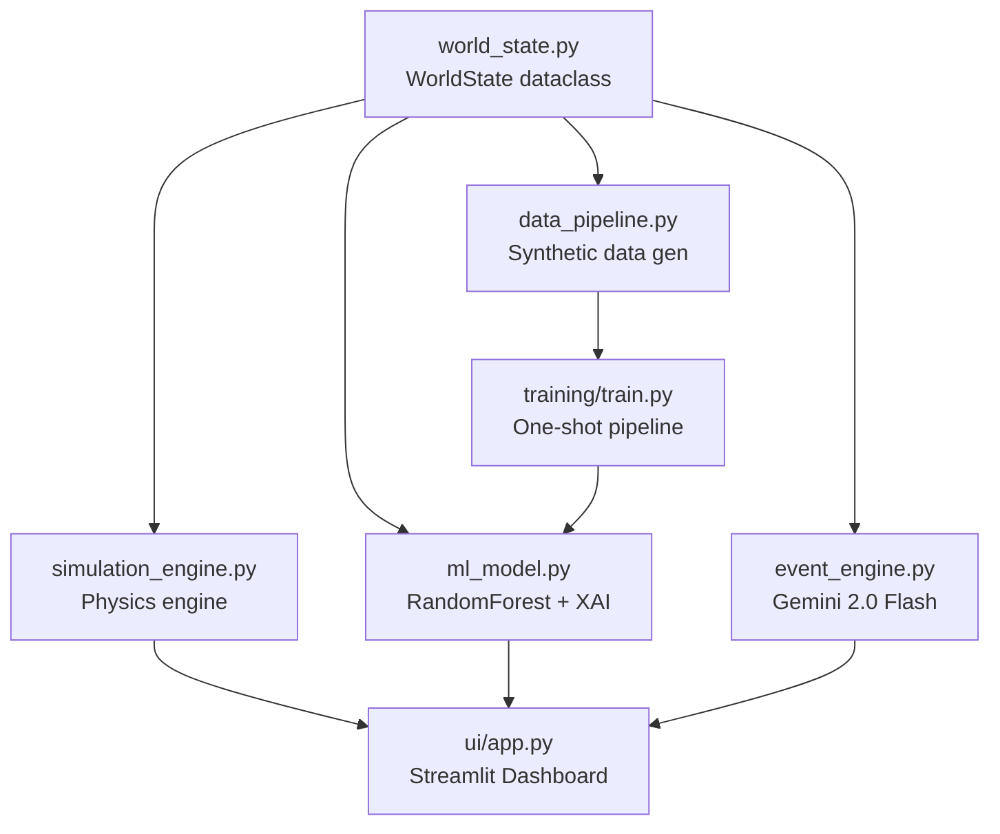

# AXIOM: Architecture Deep-Dive

## Module Dependency Graph



## Data Flow

```
Player Input (policy) → simulation_engine.step()
                                ↓
                        WorldState updated
                       ↙                ↘
        ml_model.predict_and_explain()  event_engine.generate_event()
                ↓                                ↓
        (delta_pop, importances,           (narrative, effects dict)
          confidence_flag)
                ↘                              ↙
                    simulation_engine.apply_event()
                                ↓
                        WorldState updated
                                ↓
                        Streamlit re-renders
```

## WorldState Variable Interactions

| Variable | Increases From | Decreases From |
|---|---|---|
| `population` | high food ratio, low pollution | starvation, pollution, events |
| `food` | Agriculture policy, tech bonus | Annual consumption, drought events |
| `energy` | Industry policy | None (events) |
| `technology` | Education policy | None |
| `pollution` | Industry, Agriculture | Environment policy, clean-tech (tech>100) |
| `economy` | Industry, trade events | Environment policy, events |
| `happiness` | Economy, Environment | Pollution, events |
| `legitimacy` | High happiness trajectory | Low happiness, revolution events |
